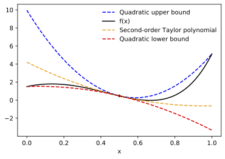

# AutoBound: Automatically Bounding Functions

AutoBound is a generalization of automatic differentiation.  In addition to
computing a Taylor polynomial approximation of a function, it computes upper
and lower bounds that are guaranteed to hold over a user-specified
_trust region_.

As an example, here are the quadratic upper and lower bounds AutoBound computes
for the function `f(x) = 1.5*exp(3*x) - 25*(x**2)`, centered at `0.5`, and
valid over the trust region `[0, 1]`.

<div align="center">
</img>
</div>

The code to compute the bounds shown in this plot looks like this:

```python
import autobound.jax as ab
import jax.numpy as jnp

f = lambda x: 1.5*jnp.exp(3*x) - 25*x**2
x0 = .5
trust_region = (0, 1)
# Compute quadratic upper and lower bounds on f.
bounds = ab.taylor_bounds(f, 2)(x0, trust_region)
# bounds.upper(1) == 5.1283045 == f(1)
# bounds.lower(0) == 1.5 == f(0)
# bounds.coefficients == (0.47253323, -4.8324013, (-5.5549355, 28.287888))
```

These bounds can be used for:

- Computing learning rates that are guaranteed to reduce a loss function
- Upper and lower bounding integrals
- Proving optimality guarantees in global optimization

and more!

*Example code coming soon*

Under the hood, AutoBound computes these bounds using an interval arithmetic
variant of Taylor-mode automatic differentiation.  Accordingly, the memory
requirements are linear in the input dimension, and the method is only
practical for functions with low-dimensional inputs.  A reverse-mode algorithm
that efficiently handles high-dimensional inputs is under development.

A paper describing AutoBound will be released soon.

---

*This is not an officially supported Google product.*
